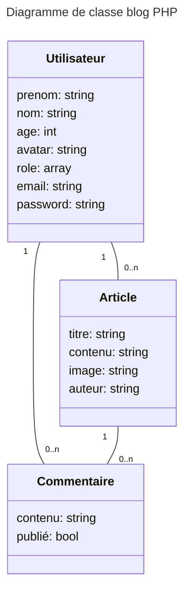

```mermaid

---
title: Diagramme de classe blog PHP
---

classDiagram
  class Utilisateur{
    prenom: string
    nom: string
    age: int
    avatar: string
    role: array
    email: string
    password: string
  }

  class Article{
    titre: string
    contenu: string
    image: string
    auteur: string
  }

  class Commentaire{
    contenu: string
    publié: bool
  }

  Utilisateur "1"--"0..n" Commentaire
  Article "1"--"0..n" Commentaire
  Utilisateur"1"--"0..n" Article

```
