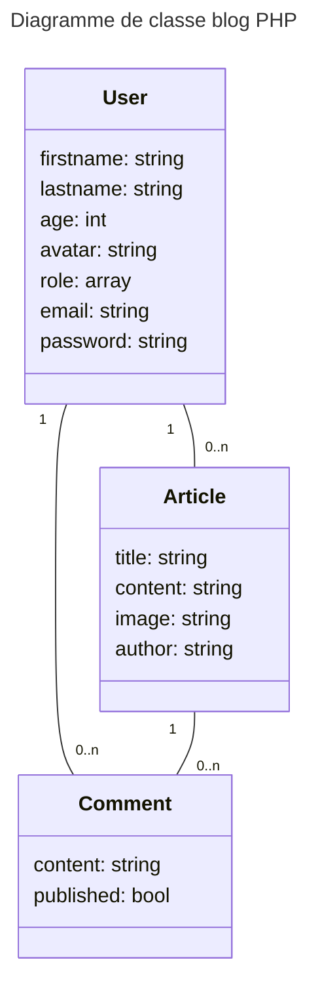

```mermaid

---
title: Diagramme de classe blog PHP
---

classDiagram
  class User{
    firstname: string
    lastname: string
    age: int
    avatar: string
    role: array
    email: string
    password: string
  }

  class Article{
    title: string
    content: string
    image: string
    author: string
  }

  class Comment{
    content: string
    published: bool
  }

  User "1"--"0..n" Comment
  Article "1"--"0..n" Comment
  User"1"--"0..n" Article

```
