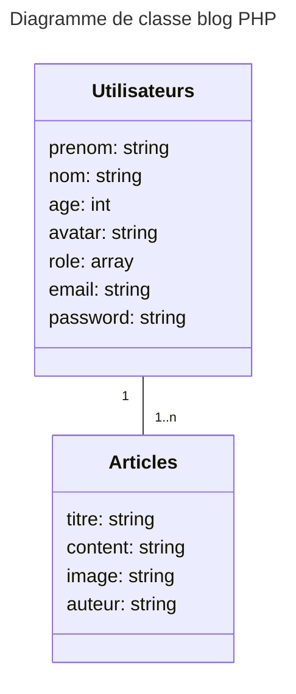

```mermaid

---
title: Diagramme de classe blog PHP
---

classDiagram
  class Utilisateurs{
    prenom: string
    nom: string
    age: int
    avatar: string
    role: array
    email: string
    password: string
  }

  class Articles{
    titre: string
    content: string
    image: string
    auteur: string
  }

  Utilisateurs "1"--"1..n" Articles

```
