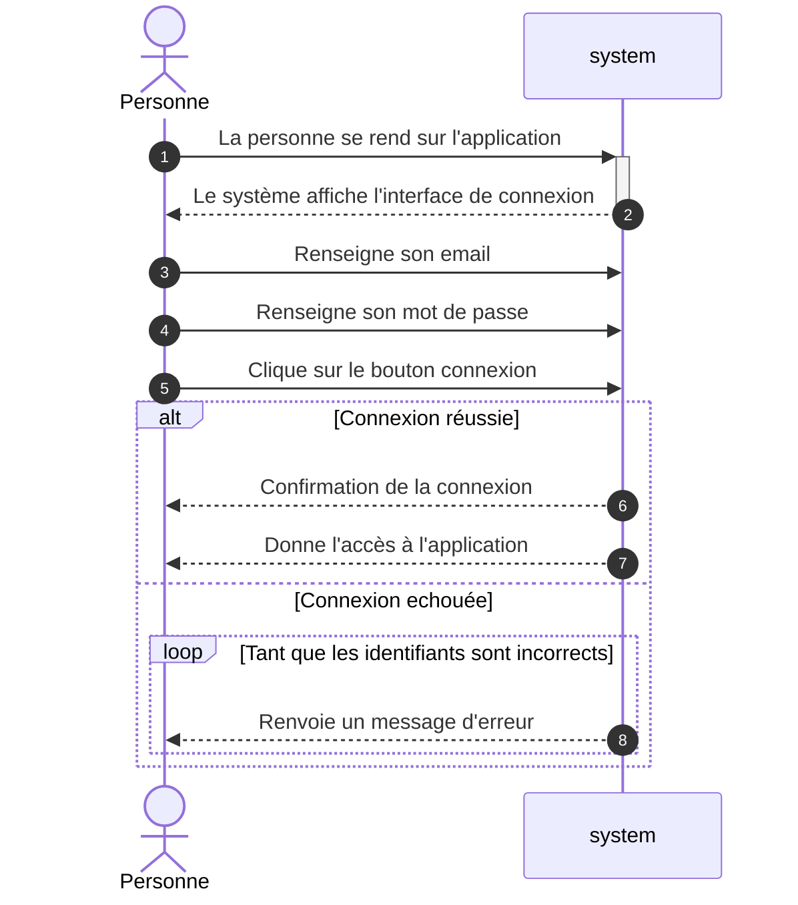

```mermaid
sequenceDiagram
    autonumber
    actor Personne 

    Personne->>+system: La personne se rend sur l'application
    system-->>-Personne: Le système affiche l'interface de connexion

    Personne->>system: Renseigne son email
    Personne->>system: Renseigne son mot de passe
    Personne->>system: Clique sur le bouton connexion

    alt Connexion réussie
    system-->>Personne: Confirmation de la connexion
    system-->>Personne: Donne l'accès à l'application

    else Connexion echouée
      loop Tant que les identifiants sont incorrects
      system-->>Personne: Renvoie un message d'erreur
    end
end

```
