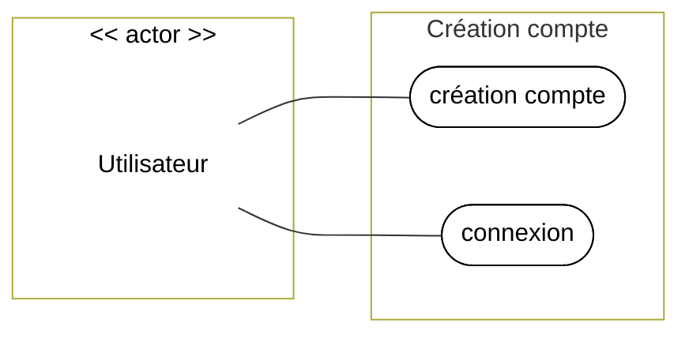

```mermaid

  flowchart LR
  subgraph actor[<< actor >>]
    Utilisateur[Utilisateur]
  end

  subgraph system ["Création compte"]
    create([création compte])
    login([connexion])
  end

class Utilisateur,create,login noBg
class actor,system,login,create whiteBg
class create,login blackBorder
class Utilisateur noBorder
class actor,Utilisateur,create,login blackFont


classDef noBg fill: none
classDef whiteBg fill: #fff
classDef blackBorder stroke: #000
classDef noBorder stroke:none
classDef blackFont color:#000

Utilisateur --- create
Utilisateur --- login

```