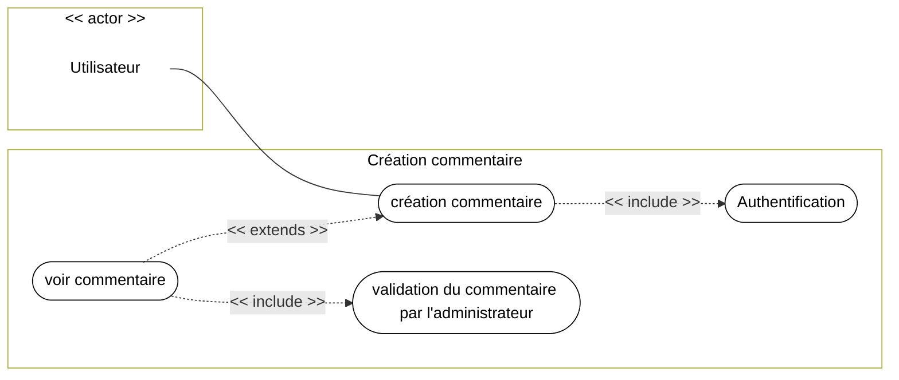

```mermaid
  flowchart LR
  subgraph actor[<< actor >>]
    utilisateur[Utilisateur]
  end

  subgraph system ["Création commentaire"]
    auth([Authentification])
    create([création commentaire])
    voir([voir commentaire])
    validate([validation du commentaire par l'administrateur])
  end

class utilisateur,auth,create,voir,validate noBg
class actor,system whiteBg
class gestion,create,voir,validate,auth blackBorder
class utilisateur noBorder
class actor,utilisateur,system,create,voir,validate,auth blackFont


classDef noBg fill: none
classDef whiteBg fill: #fff
classDef blackBorder stroke: #000
classDef noBorder stroke:none
classDef blackFont color:#000

utilisateur --- create
create -. << include >> .-> auth
voir -. << extends >> .-> create
voir -. << include >> .-> validate

```
