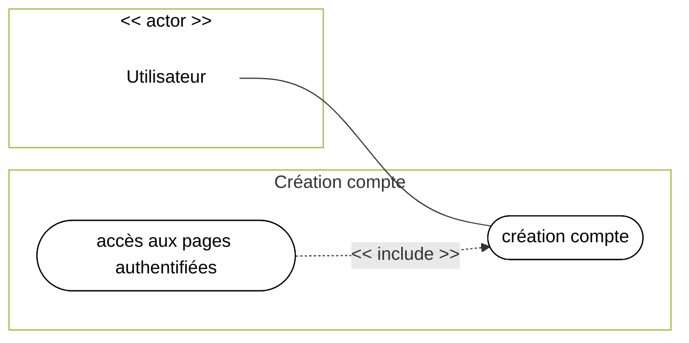

```mermaid
  flowchart LR
  subgraph actor[<< actor >>]
    Utilisateur[Utilisateur]
  end

  subgraph system ["Création compte"]
    create([création compte])
    access([accès aux pages authentifiées])
  end

class Utilisateur,create noBg
class actor,system,access,create whiteBg
class create,access blackBorder
class Utilisateur noBorder
class actor,Utilisateur,create,access blackFont


classDef noBg fill: none
classDef whiteBg fill: #fff
classDef blackBorder stroke: #000
classDef noBorder stroke:none
classDef blackFont color:#000

Utilisateur --- create
access -. << include >> .-> create

```
