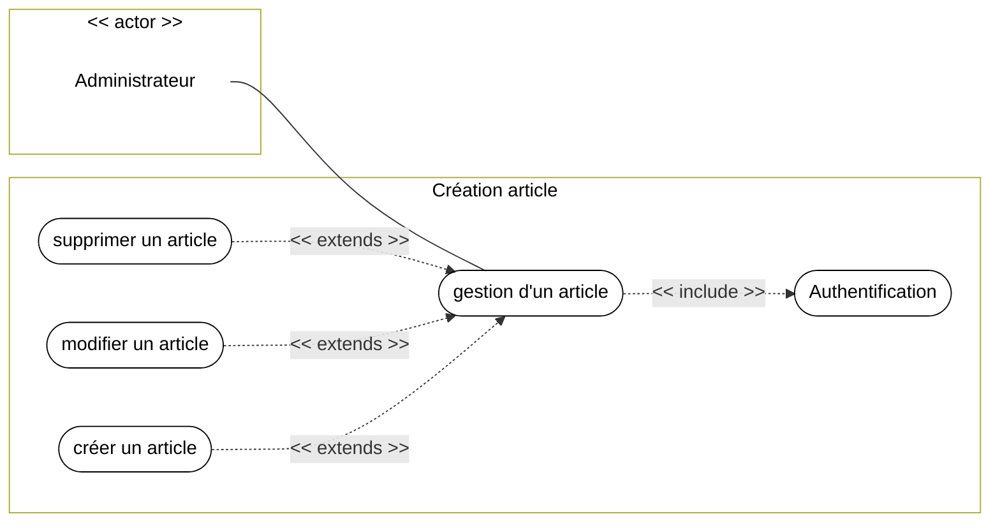

```mermaid
  flowchart LR
  subgraph actor[<< actor >>]
    administrateur[Administrateur]
  end

  subgraph system ["Création article"]
    auth([Authentification])
    gestion([gestion d'un article])
    supp([supprimer un article])
    mod([modifier un article])
    creer([créer un article])
  end

class administrateur,auth,gestion,supp,mod,creer noBg
class actor,system whiteBg
class gestion,supp,mod,creer,auth blackBorder
class administrateur noBorder
class actor,administrateur,system,supp,mod,creer,auth,gestion blackFont


classDef noBg fill: none
classDef whiteBg fill: #fff
classDef blackBorder stroke: #000
classDef noBorder stroke:none
classDef blackFont color:#000

administrateur --- gestion
gestion -. << include >> .-> auth
supp -. << extends >> .-> gestion
mod -. << extends >> .-> gestion
creer -. << extends >> .-> gestion
```
